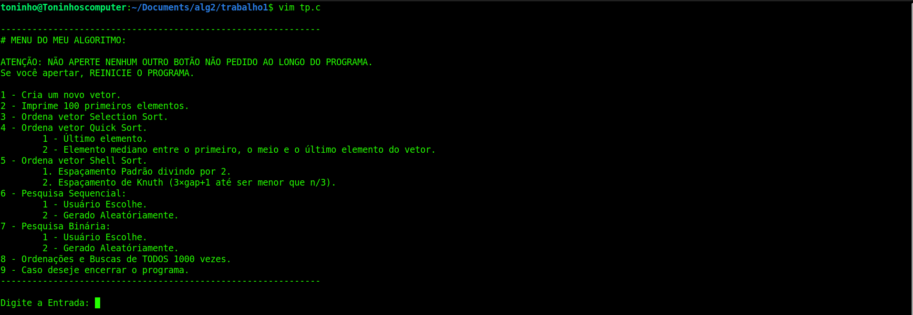
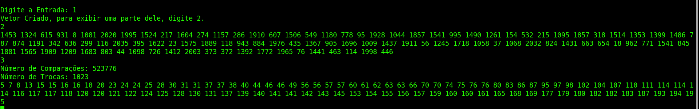
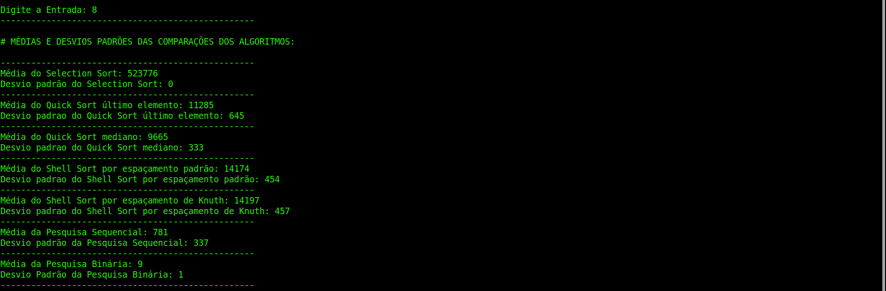

# Sorting and Searching Algorithms
## Desenvolvido na matéria de Algoritmos e Estruturas de Dados 2 (Developed in the Algorithms & Data Structures II course)
## Antonio da Ressurreição Filho, student in the second semester of Computer Science at the Federal University of Paraná (UFPR).
## Professor: [Dr. Elias P. Duarte Jr.](https://www.inf.ufpr.br/elias/)

# Português:

O trabalho foi desenvolvido segundo as especificações contidas no site do docente Dr. Elias P. Duarte Jr.. O objetivo principal do projeto é
o aprendizado a respeito dos algoritmos de ordenação Selection Sort, Shell Sort e Quick Sort e dos algoritmos de pesquisa Sequencial e Binária,
por meio das comparações e trocas que cada um dos algoritmos anteriormente mencionados faz.

***Arquivo "Relatório de ALG2.pdf":***

Esse documento foi feito a partir das especificações do docente Dr. Elias P. Duarte Jr., o qual solicitou um relatório, em forma de diário, dos
dias em que o trabalho foi criado e o que foi desenvolvido no respectivo dia. Nele, há imagens do código capturadas durante a criação do mesmo e
diversas explicações de onde vieram cada um desses algoritmos, sejam de aulas de outras matérias da faculdade ou até mesmo da própria aula da
matéria de Algoritmos e Estruturas de Dados 2.

***Pasta "Logs":***

Nessa pasta estão os Logs de cada função contida no programa principal. Esses arquivos consistem basicamente da prova real que as funções funcionam
para diferentes casos, buscando números aleatórios diferentes em cada execução e provando a funcionalidade de cada uma delas, como por exemplo a função 
do Quick Sort pegando um vetor de números aleatórios não ordenados e os ordenando.

***Arquivos "tp.c" e "tp.c.txt":***

A única diferença entre esses dois arquivos é o nome dado, seguindo as especificações pedidas pelo dicente da matéria para se fazer o site foi necessário
a criação de um segundo arquivo o qual só se muda o nome. Neles, há o código do programa principal desse projeto, em que começa-se com as funções segundárias
de cada algoritmo de ordenação e busca e logo após isso a função principal que chama todas essas funções e adiciona alguns prints para o usuário não se
confundir.

## Imagens do visual que aparece para o usuário quando ele executa o programa:

- Menu do algoritmo:

- Criando um vetor de 1024 elementos [digitando 1], printando os 100 primeiros elementos dele [digitando 2] e ordenando ele por meio do Selection Sort e printando
os novos 100 primeiros elementos desse vetor [digitando 3]:

- Selecionando a opção de fazer cada um dos algoritmos 1000 vezes e printando as estatísticas de cada algoritmo:

# English:

The project was developed according to the specifications provided on the website of Professor Dr. Elias P. Duarte Jr. The primary objective of the project is to learn 
about the sorting algorithms Selection Sort, Shell Sort, and Quick Sort, as well as the searching algorithms Sequential Search and Binary Search, by analyzing the comparisons 
and swaps each algorithm performs.

***File "Relatório de ALG2.pdf":***

This document was created based on the specifications provided by Professor Dr. Elias P. Duarte Jr., who requested a report in the form of a diary, detailing the days when the 
project was developed and what was accomplished on each respective day. It includes code screenshots taken during its creation and several explanations about the origins of 
these algorithms, whether from lectures in other courses at the university or even from the lectures of **Algorithms and Data Structures 2**.

***Folder "Logs":***

This folder contains logs of each function in the main program. These files serve as proof that the functions work for different cases, using different random numbers on each 
execution and demonstrating their functionality. For example, the Quick Sort function processes an unsorted array of random numbers and sorts it.

***Files "tp.c" and "tp.c.txt":***

The only difference between these two files is their names. According to the course specifications for creating the website, it was necessary to generate a second file with only 
the name changed. These files contain the main program code for this project, starting with the auxiliary functions for each sorting and searching algorithm, followed by the main function, which calls all these functions and includes some prints to prevent user confusion.

## Visual Examples Displayed to the User When Running the Program:

- Algorithm Menu:  

- Creating an array with 1024 elements [by typing 1], printing its first 100 elements [by typing 2], sorting it using Selection Sort, and printing the first 100 elements again 
[by typing 3]:  

- Selecting the option to run each algorithm 1000 times and printing the statistics for each algorithm:  

